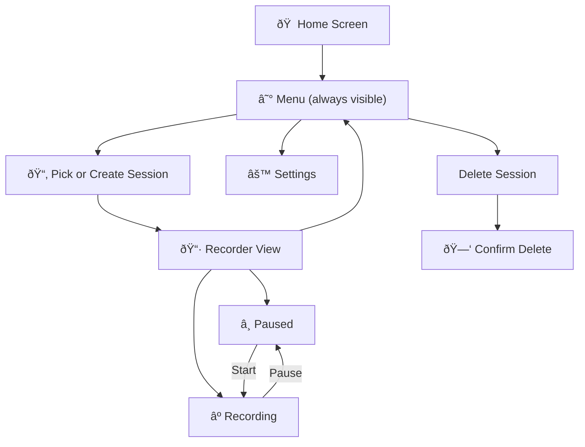

```mermaid
flowchart TD
  Home["🠠Home Screen"]
  Menu["☰ Menu (always visible)"]
  SessionPicker["📂 Pick or Create Session"]
  Recorder["📷 Recorder View"]
  Paused["⸠Paused"]
  Recording["⺠Recording"]
  Settings["âš™ Settings"]
  ConfirmDelete["🗑 Confirm Delete"]
  Delete["Delete Session"]

  Home --> Menu
  Menu --> SessionPicker
  SessionPicker --> Recorder
  Recorder --> Menu
  Menu --> Settings
  Menu --> Delete --> ConfirmDelete
  Recorder --> Paused
  Recorder --> Recording
  Recording -->|Pause| Paused
  Paused -->|Start| Recording
```